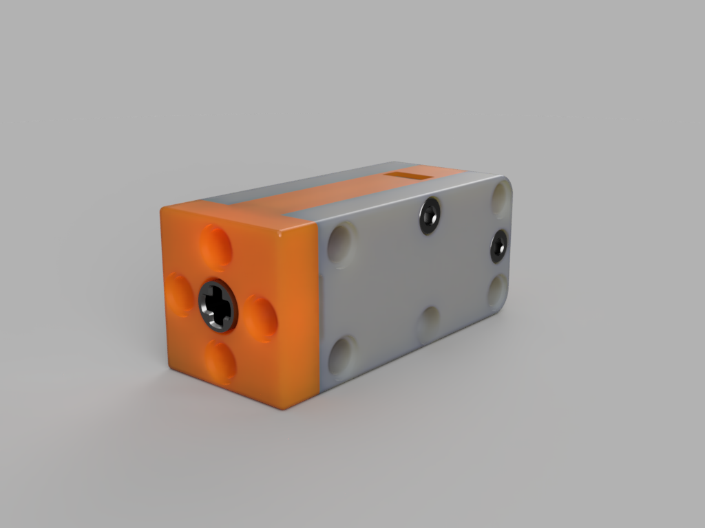

# Lego Techic Compatible N20 Motor Case (3D Printed)

## Description

  

### Features
- **Motor**: Designed to fit the N20 Gear Motor
- **Technic**: Designed to fit Lego Technic
- **Case**: Designed to protect the motor and provide a mounting point
- **Material**: PLA or PETG
- **Hardware**: M3 screws and nuts

## Contents
- [Lego Techic Compatible N20 Motor Case (3D Printed)](#lego-techic-compatible-n20-motor-case-3d-printed)
  - [Description](#description)
    - [Features](#features)
  - [Contents](#contents)
  - [Lego Technic Dimensions](#lego-technic-dimensions)
  - [Assembly](#assembly)
  - [Specifications](#specifications)
  - [STL Files](#stl-files)
  - [A note on tolerances](#a-note-on-tolerances)
  - [License](#license)

## Lego Technic Dimensions

## Assembly

## Specifications

## STL Files

## A note on tolerances

## License
