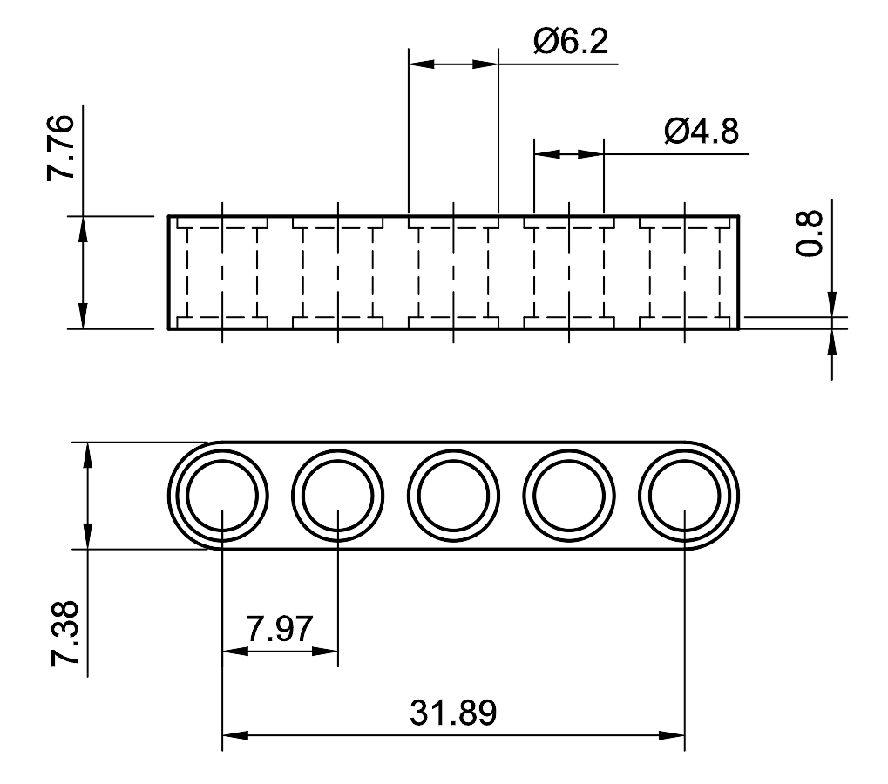

# Lego Technic Compatible N20 Motor Case (3D Printed) <!-- omit in toc -->

    
    <video width="320" height="240" src="media/Explode.webm" type="video/webm" autoplay controls></video>

## Description <!-- omit in toc -->

### Features
- Designed to fit the [N20 Gear Motor with encoder](https://www.amazon.ca/dp/B07HH9MTDT)
- Compatible with Lego Technic parts
- Includes d-shaft to technic axle adapter
- **Material**: PLA or PETG
- **Hardware**: 3x M3x20mm bolt, 3x M3 nut, 2x M2.5x5mm screw

## Contents <!-- omit in toc -->
- [Introduction](#introduction)
- [Lego Technic Dimensions](#lego-technic-dimensions)
- [Assembly](#assembly)
- [Specifications](#specifications)
- [STL Files](#stl-files)
- [A note on tolerances](#a-note-on-tolerances)
- [License](#license)

## Introduction

## Lego Technic Dimensions

    

## Assembly

## Specifications

## STL Files

## A note on tolerances

## License
